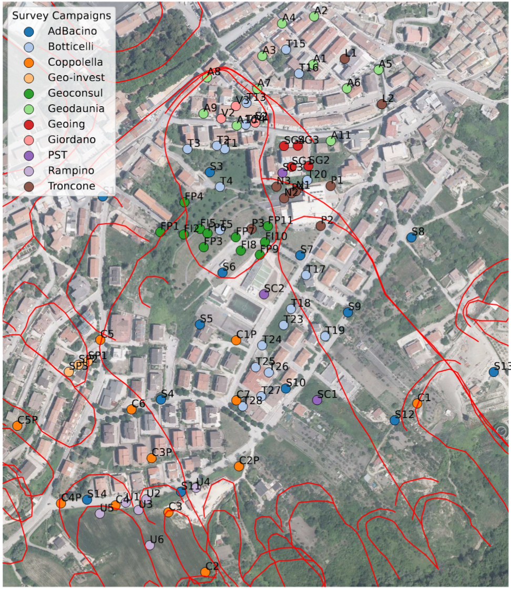

% 1 - The geological question

# Can a model interpret a borehole and recognize when its interpretation is unreliable?

## Start with the expert's task

A log describes materials encountered along depth. Geotechnical interpretation assigns those observations to units relevant to the subsurface model. Recognizing "silty clay" does not uniquely determine the geotechnical unit.

At the Pianello hillslope near Bovino, the targets include topsoil, eluvial deposits, debris, and three Flysch-related facies. Materials share vocabulary across units. Weathering and gradual transitions make some interfaces interpretive rather than perfectly sharp.

The 95 boreholes belong to 11 campaigns. Nearby observations may share geology; observations from one campaign may share terminology. Both relationships influence validation.

## A running example from the manuscript

The manuscript reports these observations from C1, Coppolella campaign. The English descriptions and expert labels below come from its example table, not a model prediction.

| Depth support | Description | Expert unit |
|---|---|---|
| 0.0-3.5 m | Moderately compacted sandy silt of brownish color with white calcareous layers. Frequent brown clayey bands are present. The material is slightly moist. | Eluvial (4) |
| 3.5-5.5 m | Soft hazel-colored silty clay with small sandy layers. Ochre-colored oxidation bands are present. The material is moist. | Debris (3) |
| 67.8-68.3 m | White micritic limestone, moderately fractured. | Clay Flysch (2a) |

The last row illustrates that material description and geotechnical label are not synonyms. The table alone does not explain the expert's rationale. Surrounding succession and geological setting may matter. The example shows why the surrounding succession is relevant to classification.

## What evidence is available?

The principal model receives description embeddings, X, Y, Z and depth. Pocket-penetrometer measurements, piezometric information and some prior knowledge available to the expert are absent.

An error can therefore reflect inadequate modelling, ambiguous evidence, or an interpretive annotation. The expert labels remain our supervised reference; they are not an uncertainty-free physical measurement.

## Two linked scientific questions

First, do descriptions add information beyond coordinates and depth, and does vertical context help use that information?

Second, when performance deteriorates on a new campaign or without nearby training data, do uncertainty estimates provide a useful warning?

The manuscript motivates contextual classification and examines MC dropout. The later experiments extend this to multiple embedding models, PCA dimensions, representations and five UQ strategies. We distinguish those extensions from the original manuscript experiment.

Next: [From logs to a dataset](02_learning_dataset.md).
