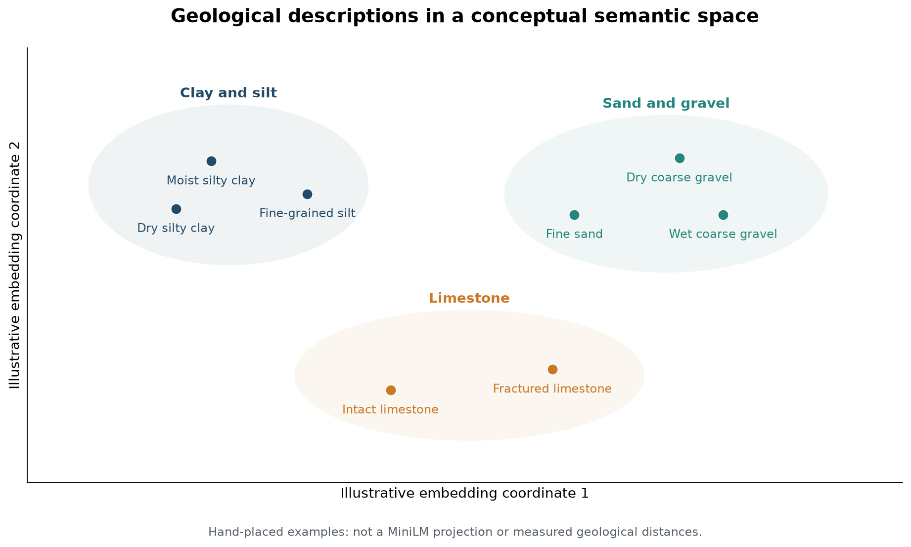

% 3 - Turning descriptions into features

# How does a sentence become a numerical input?

## Representation before classification

A sentence encoder maps text to a numerical vector. MiniLM produces 384 values per description. These are learned features, not explicit measurements of clay content or stiffness.

Related descriptions may correspond to nearby vectors, but general-purpose language pretraining does not guarantee separation of geotechnical units. The sandy-silt and silty-clay descriptions in our example become vectors before the downstream model assigns any geological label.

*Illustrative arrangement, not measured MiniLM embeddings. Related descriptions are placed near one another; the axes are arbitrary and have no physical units.*

The clay descriptions form one neighbourhood, sand and gravel another, and limestone descriptions a third. Within a neighbourhood, wording about moisture or fracturing can still distinguish observations. The layout illustrates the idea of semantic proximity; it does not assert that MiniLM encodes these properties as separate axes.

## Sentence-BERT and MiniLM

Sentence-BERT was introduced as an adaptation of BERT for producing sentence embeddings that can be compared efficiently. A Transformer encoder first builds contextual token representations; a pooling operation combines them into a sentence vector. See [Reimers and Gurevych, Sentence-BERT](https://aclanthology.org/D19-1410/).

Here we use the Sentence Transformers model all-MiniLM-L6-v2, a compact encoder with mean pooling and a 384-dimensional sentence output. Its pretrained sentence representation is used as an input to the geological model. See the [MiniLM model card](https://huggingface.co/sentence-transformers/all-MiniLM-L6-v2).

## Two different networks

| Component | Role | Learning in the cached workflow |
|---|---|---|
| Pretrained sentence encoder | Description to embedding | Precomputed; not fine-tuned by the Bovino training |
| BOVINO MiniTransformer | Ordered interval features to class logits | Trained using labelled training boreholes |

Both can involve Transformers. Changing the sentence encoder and changing the contextual sequence model are different experiments.

## Why coordinates and depth?

Text records material observations. XYZ and depth locate them within the study area. Spatial position can be strongly predictive by itself, which motivates a controlled baseline.

The study compares depth only, XYZ plus depth, embeddings plus depth, and embeddings plus XYZ plus depth. Text-bearing configurations use different PCA dimensions or native embeddings. Native MiniLM means 384 dimensions; other encoders have other native dimensions.

A good result with all features does not establish the text contribution until compared with the spatial baseline.

## Three places to extract features

Model input contains the numerical features presented to the network. Encoder input contains the learned projection plus positional encoding and the configured dropout operation, before attention. Hidden representation is the encoder output after contextual processing.

A gain at encoder input can reflect supervised projection. A gain at hidden output is consistent with helpful context, but comparisons must match splits, preprocessing and downstream classifiers.

The sweep compares metrics across embedding models. It does not average unrelated embedding coordinates. Because models share the same evaluation observations, they are not independent geological replications.

Next: [PCA](04_pca_explained.md).
