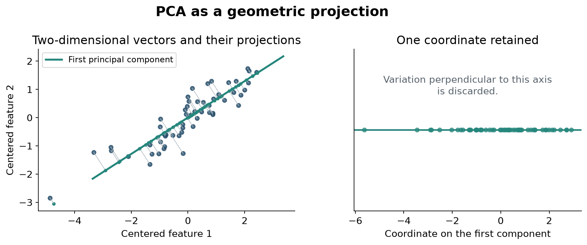

% 4 - PCA explained

# Representing variation with fewer coordinates

## Geometric intuition

Imagine a narrow diagonal cloud in a two-dimensional plot. Rotating the axes can place most variation along one direction. Keeping that direction compresses the cloud, while discarding the perpendicular direction loses information.

Principal component analysis generalizes this to hundreds of embedding coordinates. It centers vectors and finds orthogonal directions of decreasing variance. For embedding e, fitted mean mu, and k retained directions in W:

$$z=(e-\mu)W_k.$$

MiniLM has 384 coordinates; PCA16 retains 16 projected coordinates. Every description uses the same fitted transformation.

*Illustrative data: PCA finds the direction of greatest variation and projects the points onto it. This geometric example is not a visualization of the Bovino embeddings.*

## Variance is not predictive relevance

The retained variance fraction is:

$$\frac{\sum_{j=1}^{k}\lambda_j}{\sum_{j=1}^{d}\lambda_j},$$

where lambda denotes component variance. PCA selects directions using variation in the embeddings, without considering class labels. Explained variance therefore does not measure how well the projected features separate the geotechnical units.

PCA does not use labels to choose directions and is not guaranteed to denoise data or improve accuracy.

## Why test it here?

Compression can reduce redundancy, input-projection parameters and computational cost in a small dataset. It can also discard useful information.

PCA16 plus XYZ and depth gives 20 input features. Native MiniLM plus those same variables gives 388. A component sweep tests this tradeoff; 16 is a studied operating point, not an inherently optimal value.

## Applying PCA in cross-validation

In an inductive experiment:

1. Define training and held-out boreholes.
2. Fit PCA on training observations.
3. Transform both sets with that fitted PCA.
4. Train the classifier and evaluate held-out predictions.

The PCA transformation is fitted once for a training fold and reused to transform its training and held-out observations.

Fitting PCA once on all boreholes uses held-out covariates, even without their labels. It is a transductive preprocessing choice and should be labelled explicitly.

Next: [Attention and Transformers](05_attention_explained.md).
