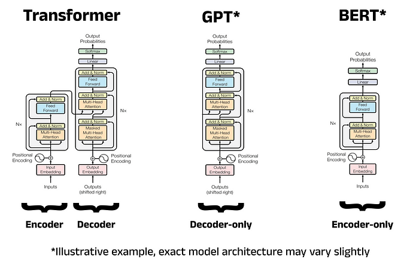

% 5 - Attention and Transformers

# Learning from the vertical sequence

## Why context?

An isolated classifier processes each interval separately. A contextual network updates an interval's representation using other intervals in the borehole.

A thin limestone observation may have a different interpretation depending on the surrounding succession. The model's ability to exploit this is a hypothesis to test, not a guaranteed consequence of using attention.

## Encoder, decoder and encoder-decoder

The three arrangements below use related Transformer blocks but provide different access to context and support different training objectives.

| Family | How context is used | Typical role |
|---|---|---|
| Encoder-only, as in BERT | Each position can attend to both earlier and later positions in the input | Contextual representations for classification, retrieval or other prediction tasks |
| Decoder-only, as in GPT | Causal attention accesses preceding positions when predicting the next token | Autoregressive text generation |
| Encoder-decoder | An encoder represents the source; a decoder generates an output while attending to that source | Sequence-to-sequence tasks such as English-to-French translation |

BERT and GPT are therefore not mathematical opposites. Their characteristic differences concern attention access and pretraining objectives. Encoders can support prediction heads, and decoders also build internal representations.

Sentence-BERT uses encoder representations to obtain a sentence vector. In the Bovino model, an encoder operates at another level: its positions are geological depth intervals, represented by numerical features. A classification head assigns a unit at each position.

This explains why the encoder-only family is relevant here. We interpret an available sequence instead of generating a translated or continued text.

*Architecture comparison supplied with the seminar material. The right-hand, encoder-only arrangement is the relevant family for our model. Here, the classifier returns a geotechnical class at each depth position; it does not generate the next word.*

## Query, key and value

Each interval vector h_i is projected into query q_i, key k_i and value v_i. Intuitively, the query describes information sought, the key supplies a match, and the value supplies information to combine. These are learned numerical vectors, not literal geological questions.

Attention weights are:

$$a_{ij}=\frac{\exp(q_i^T k_j/\sqrt{d_k})}{\sum_l\exp(q_i^T k_l/\sqrt{d_k})}.$$

The update is:

$$o_i=\sum_j a_{ij}v_j.$$

Weights sum to one across source positions. An illustrative set of weights 0.6, 0.3 and 0.1 combines three value vectors in those proportions. These weights are neither class probabilities nor uncertainty estimates.

## Multihead attention

Several heads use different learned query, key and value projections. Their outputs are concatenated and projected back to model dimension.

With dimension 128 and 16 heads, each head uses dimension 8. Heads may learn different relationships but are not assigned geological meanings in advance. They are not independent ensemble members.

## Position, depth and direction

Attention alone does not encode above and below. Sinusoidal positional encoding adds information about sequence position. Physical depth remains a separate input variable.

The supplied encoder is bidirectional: it can use both shallower and deeper positions of the available borehole. This supports interpretation of a completed log. It does not establish performance during drilling when deeper observations are unavailable.

## The rest of the encoder

A feed-forward network transforms each position after information exchange. Residual connections preserve a path for the incoming features. Layer normalization controls intermediate feature scales, and dropout introduces stochastic removal of activations.

Attention exchanges information; the feed-forward network transforms it. Neither imposes a mandatory stratigraphic ordering or a physical geological law.

Next: [The implemented network](06_bovino_network.md).
