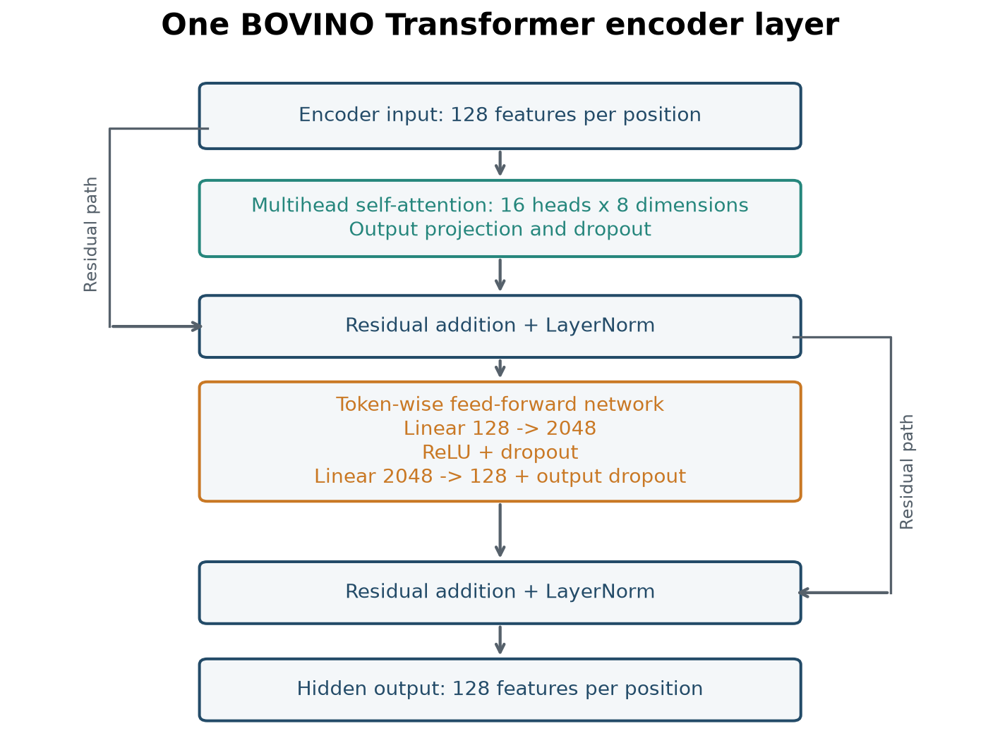
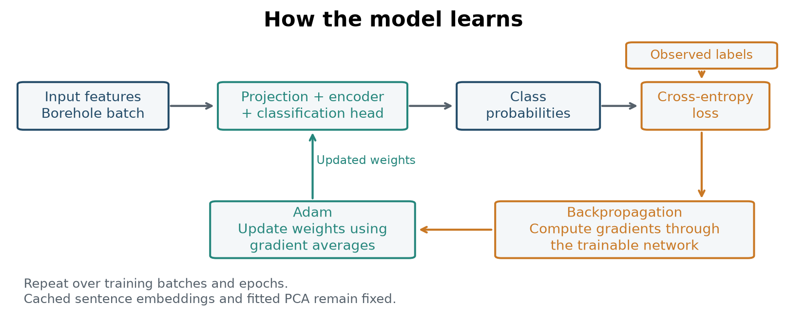

% 6 - The implemented BOVINO network

# From 20 features to six probabilities

## Trace a batch

Let B be the number of boreholes in a batch and L the number of positions. The reference MiniLM PCA16 plus XYZ/depth configuration has this path:

| Stage | Shape | Operation |
|---|---|---|
| Model input | B x L x 20 | 16 PCA coordinates plus X, Y, Z, depth |
| Projection | B x L x 128 | Learned linear projection |
| Encoder input | B x L x 128 | Sinusoidal position and dropout |
| Hidden representation | B x L x 128 | One encoder layer, 16 heads |
| Classifier input | B x L x 128 | Classifier dropout |
| Logits | B x L x 6 | Linear classification head |
| Probabilities | B x L x 6 | Softmax across classes |

The definition is MiniTransformerPerElement in src/scripts/models/MiniTransformer.py in the Full package. The Results Explorer reads saved outputs.

PCA and the 128-dimensional projection are different: PCA fits embedding variation; the network projection learns through the classification objective.

## The encoder block

The supplied launcher uses model dimension 128, one encoder layer, 16 heads and dropout 0.1. Dropout occurs before the encoder, inside its layer and before classification.

After multihead attention and the first residual connection with layer normalization, a feed-forward network transforms each token independently. It uses two dense layers: **128 to 2048**, followed by **ReLU** and dropout, then **2048 to 128**. A second residual connection and layer normalization complete the encoder block.

ReLU applies $\operatorname{ReLU}(x)=\max(0,x)$ element by element. It introduces nonlinearity between the two linear transformations. The 2048 values are intermediate features for one token, not additional tokens or attention heads. The same feed-forward weights are used at every depth position.

*Attention exchanges information between positions. The feed-forward network transforms the resulting features at each position. Both residual paths return a 128-dimensional representation.*

The encode method exposes encoder_input, hidden and classifier_input. No padding or causal mask is passed to the encoder. Validity selection for loss and evaluation is a separate operation.

## Cross-entropy loss

For observed class y_i and predicted probability p_i,y_i, masked cross-entropy is:

$$\mathcal L=-\frac{1}{N_{valid}}\sum_{i\in valid}\log p_{i,y_i}.$$

A low probability for the observed class produces a larger penalty. Gradients update the projection, encoder and classification head. Cached sentence embeddings remain fixed.

There is one prediction per position. Softmax normalizes across the six classes at that position, not across depth.

## Backpropagation and Adam

Training repeats a cycle. A forward pass maps a batch of borehole sequences to predicted class probabilities. Cross-entropy compares these probabilities with the observed labels. Backpropagation then computes how the loss changes with each trainable weight, using the chain rule through the classification head, encoder and input projection.

If a small increase in a weight would increase the loss, its gradient is positive. A basic gradient-descent step would move that weight in the opposite direction. Backpropagation computes these gradients; the optimizer decides the parameter update.

Let $g_t$ be the gradient computed for the current training batch. Plain SGD uses the update $\theta_{t+1}=\theta_t-\eta g_t$.

Adam instead maintains two moving averages, initialized at zero:

$$m_t=\beta_1m_{t-1}+(1-\beta_1)g_t,$$

$$v_t=\beta_2v_{t-1}+(1-\beta_2)g_t^2.$$

The square is elementwise. The first average tracks gradient direction; the second tracks its squared magnitude. Because both start at zero, Adam corrects their initial bias:

$$\hat m_t=\frac{m_t}{1-\beta_1^t},\qquad
\hat v_t=\frac{v_t}{1-\beta_2^t}.$$

The parameter update is:

$$\theta_{t+1}=\theta_t-\eta\frac{\hat m_t}{\sqrt{\hat v_t}+\epsilon}.$$

Each parameter thus receives an update scaled by its gradient history. This adaptive denominator and the moving averages distinguish Adam from plain SGD. Here, $\eta$ is the learning rate and $\epsilon$ is a small numerical stabilizer. Typical defaults are $\beta_1=0.9$ and $\beta_2=0.999$.

These are the core Adam equations; regularization and gradient clipping are additional training settings. See [Kingma and Ba, Adam](https://arxiv.org/abs/1412.6980).

*The sentence embeddings and fitted PCA provide the input features. Training updates the projection, Transformer encoder and classification head.*

One epoch is one pass through the training boreholes. A batch is the group processed together for a gradient update. Dropout, weight decay and gradient clipping respectively perturb activations during training, penalize large weights and limit excessive gradient norms.

## Training configuration

run_lobo.bat specifies 300 epochs, Adam, learning rate 0.0003, weight decay 0.01, gradient clipping 1.0, batch size 95 and seed 13. Fold batches can contain fewer boreholes.

At inference, MC dropout estimates predictive variability using 30 stochastic forward passes.

## What the architecture comparison establishes

The hypothesis is that vertical context helps interpret locally ambiguous descriptions. Feature ablations ask whether this depends on text, position or their combination.

A gain using the hidden representation is not alone a causal proof of attention's benefit.

The next chapters investigate how predictions vary under dropout, independently trained models, training subsets, last-layer weight sampling and in-context prediction configurations.

Next: [Validation protocols](07_validation_and_shift.md).
